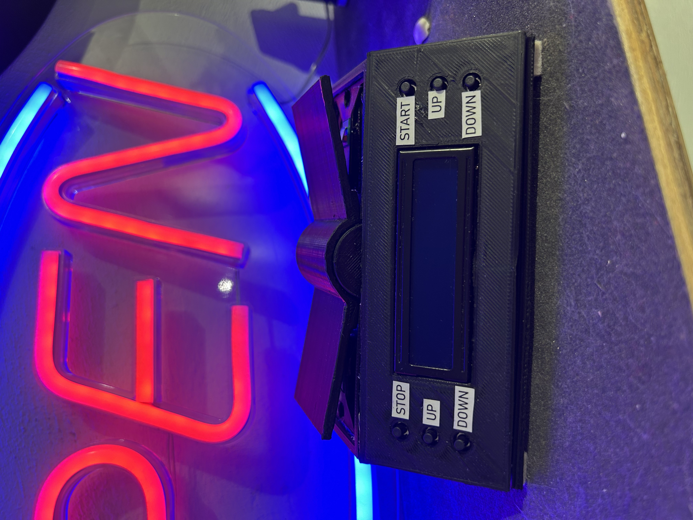
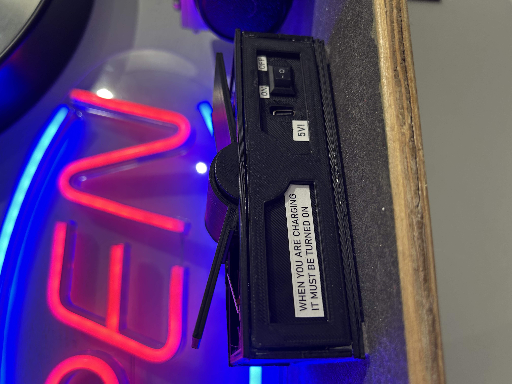

# chess_clock
### Arduino Chess Clock Project

#### Overview
This repository contains the code, schematic, and documentation for an Arduino-based chess clock designed to manage time for two players during a chess match. The project uses an Arduino Nano as the central microcontroller, paired with an I2C 2x16 LCD display to show the remaining time for each player. The clock features intuitive controls for setting time, starting/stopping the game, and switching between players, making it ideal for both casual and competitive chess games.

#### Hardware Components
- **Arduino Nano**: Main microcontroller for running the logic and controlling the display.
- **I2C 2x16 LCD Display (0x27 address)**: Displays the time for both players in "MM:SS" format.
- **18650 Battery (3.7V, 1200mAh)**: Powers the system, rechargeable via a TP4056 charging module.
- **TP4056 Charging Module**: Manages battery charging with protection.
- **MT3608 Step-Up Converter**: Boosts the battery voltage to a stable level for the Arduino.
- **Limit Switches (k1, k2)**: Detects player turns by triggering a switch.
- **Push Buttons (7 total)**:
  - "Start": Begins the countdown.
  - "Stop": Pauses the game.
  - "Up" and "Down" for Player 1 (Left): Adjusts time for Player 1.
  - "Up" and "Down" for Player 2 (Right): Adjusts time for Player 2.
- **3D-Printed Enclosure**: Houses the components, as shown in the included photo.

#### Features
- **Adjustable Time**: Players can set their time (up to 60 minutes) using the "Up" and "Down" buttons before starting the game.
- **Turn Switching**: Limit switches (k1 and k2) allow players to alternate turns by pressing their respective switch.
- **LCD Display**: Shows the time for both players, indicates the starting player ("Left" or "Right"), and displays "END T" when a player's time runs out.
- **Start/Stop Functionality**: The "Start" button initiates the countdown, and the "Stop" button pauses the game.
- **Boot-Up Screen**: Displays the creator's name ("Autor: Piotr Ciechanowski") for 3 seconds on startup.

#### Schematic
The schematic (included in the repository) illustrates the wiring setup:
- The 18650 battery connects to the TP4056 module for charging.
- The MT3608 step-up converter boosts the battery voltage to power the Arduino Nano.
- The I2C LCD is connected to the Arduino Nano via SDA (A4) and SCL (A5) pins.
- Limit switches (k1, k2) and push buttons are connected to digital pins (D2-D12) with internal pull-up resistors enabled.

#### Code
The code uses the `Wire.h` and `LiquidCrystal_I2C.h` libraries to interface with the I2C LCD. Key features of the code include:
- Time adjustment logic for both players.
- Turn-switching mechanism using limit switches.
- Countdown timer with 1-second resolution.
- Display updates to reflect the current state (time, starting player, game over).
- Serial output for debugging (e.g., "Zegar start", "Tura gracza 1").

#### Setup Instructions
1. **Hardware Assembly**:
   - Assemble the circuit as per the schematic.
   - Ensure the I2C address of the LCD (0x27) matches the code; adjust if necessary.
   - Secure the components in the 3D-printed enclosure.
2. **Software Setup**:
   - Install the Arduino IDE.
   - Add the `LiquidCrystal_I2C` library via the Library Manager.
   - Upload the provided code to the Arduino Nano.
3. **Usage**:
   - Power on the device using the battery.
   - Set the time for each player using the "Up" and "Down" buttons.
   - Select the starting player using the limit switches (k1 for Left, k2 for Right).
   - Press "Start" to begin the game, and "Stop" to pause if needed.

#### Photos
A photo of the assembled chess clock is included, showing the device mounted near a neon sign with clearly labeled buttons ("START," "STOP," "UP," "DOWN") on the 3D-printed enclosure.

#### Future Improvements
- Add a buzzer to alert players when time is running low or when the game ends.
- Implement time increment options (e.g., Fischer or Bronstein modes).
- Enhance the enclosure design for better portability and aesthetics.

#### License
This project is open-source and licensed under the MIT License. Feel free to modify and distribute it as needed.

#### Author
Created by Piotr Ciechanowski. For questions or contributions, please open an issue or submit a pull request.

